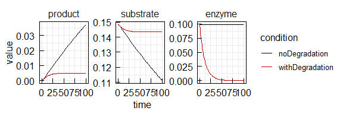
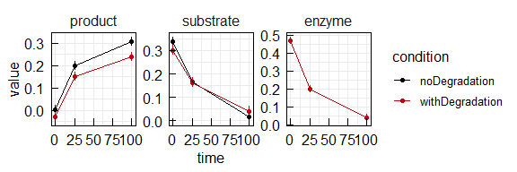
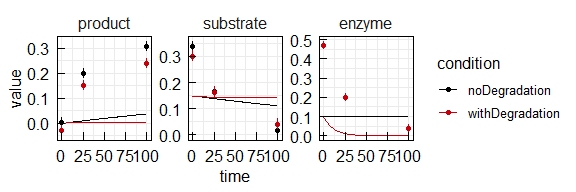
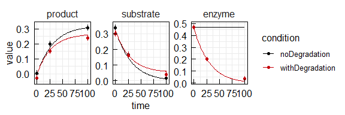
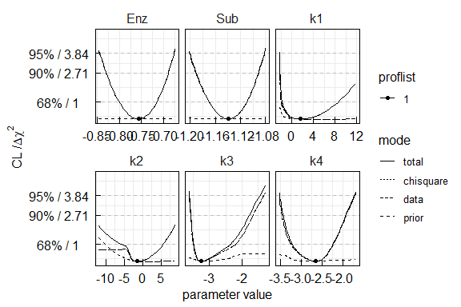

# dMod -- Dynamic Modeling and Parameter Estimation in R

The dMod package is a framework that provides functions to generate ODEs of reaction networks, parameter transformations, observation functions, residual functions, etc. The framework follows the paradigm that derivative information should be used for optimization whenever possible. Therefore, all major functions produce and can handle expressions for symbolic derivatives.

## System requirements

dMod uses the package [cOde](https://github.com/dkaschek/cOde) to set up ODE models as compiled C code (deSolve) or C++ code (Sundials). This means that **C and C++ compilers** are required on the system. On Linux, the compilers are installed by default. Windows users need to install [RTools](https://cran.r-project.org/bin/windows/Rtools/).

For **parallelization**, dMod uses `mclapply()` which is available on Linux and Mac but not on Windows. Windows users may use the `foreach` package to put dMod functions in a `%dopar%` loop.

To **install dMod from the git repository**, it is convenient to use RStudio. Create a "New Project" -> "Version Control" -> "Git". Use the address `https://github.com/dkaschek/dMod` and create project. Next, go to menu "Build" -> "Build and Reload". Once theses steps are completed, it should be possible to run the example below.

When installing dMod from git, you use the development version of dMod. Further packages might be needed to install. 

If **PEtab support** is wanted, libSBML will be required in addition. Installation and usage instructions can be found in the wiki under [Support for PEtab](https://github.com/dkaschek/dMod/wiki/Support-for-PEtab)

## Simple example: enzyme kinetics

### Load required packages

```r
library(dMod)
library(ggplot2)
```

### Generate an ODE model of enzyme kinetics with enzyme degradation

```r
# Reactions
f <- NULL
f <- addReaction(f, 
                 from = "Enz + Sub", 
                 to = "Compl", 
                 rate = "k1*Enz*Sub",
                 description = "production of complex")
f <- addReaction(f, 
                 from = "Compl", 
                 to = "Enz + Sub", 
                 rate = "k2*Compl",
                 description = "decay of complex")
f <- addReaction(f, 
                 from = "Compl", 
                 to = "Enz + Prod", 
                 rate = "k3*Compl",
                 description = "production of product")
f <- addReaction(f, 
                 from = "Enz", 
                 to = ""     , 
                 rate = "k4*Enz",
                 description = "enzyme degradation")

# ODE model
model <- odemodel(f, modelname = "enzymeKinetics")

# Prediction function
x <- Xs(model)
```

### Define observables and generate observation function `g`

```r
observables <- eqnvec(
  product = "Prod", 
  substrate = "(Sub + Compl)", 
  enzyme = "(Enz + Compl)"
)

# Generate observation functions
g <- Y(observables, x, compile = TRUE, modelname = "obsfn", attach.input = FALSE)
```

### Define parameter transformation for two experimental conditions

```r
# Get all parameters
innerpars <- getParameters(g*x)
# Identity transformation
trafo <- repar("x~x", x = innerpars)
# Set some initial value parameters
trafo <- repar("x~0", x = c("Compl", "Prod"), trafo)
# Explicit log-transform of all parameters
trafo <- repar("x~exp(x)", x = innerpars, trafo)

## Split transformation into two
trafo1 <- trafo2<- trafo

# Set the degradation rate in the first condition to 0
trafo1["k4"] <- "0"

# Generate parameter transformation functions
p <- NULL
p <- p + P(trafo1, condition = "noDegradation")
p <- p + P(trafo2, condition = "withDegradation")
```

### Initialize parameters and make prediction

```r
# Initialize with randomly chosen parameters
set.seed(1)
outerpars <- getParameters(p)
pouter <- structure(rnorm(length(outerpars), -2, .5), names = outerpars)
times <- 0:100


plot((g*x*p)(times, pouter))
```

<!-- -->

### Define data to be fitted by the model

```r
data <- datalist(
  noDegradation = data.frame(
    name = c("product", "product", "product", "substrate", "substrate", "substrate"),
    time = c(0, 25, 100, 0, 25, 100),
    value = c(0.0025, 0.2012, 0.3080, 0.3372, 0.1662, 0.0166),
    sigma = 0.02),
  withDegradation = data.frame(
    name = c("product", "product", "product", "substrate", "substrate", "substrate", "enzyme", "enzyme", "enzyme"),
    time = c(0, 25, 100, 0, 25, 100, 0, 25, 100),
    value = c(-0.0301,  0.1512, 0.2403, 0.3013, 0.1635, 0.0411, 0.4701, 0.2001, 0.0383),
    sigma = 0.02)
)

timesD <- sort(unique(unlist(lapply(data, function(d) d$time))))

# Compare data to prediction
plot(data) + geom_line()
```

<!-- -->

```r
plot((g*x*p)(times, pouter), data)
```

<!-- -->

### Define an objective function to be minimized and run minimization by `trust()`

```r
# Define prior values for parameters
prior <- structure(rep(0, length(pouter)), names = names(pouter))

# Set up objective function
obj <- normL2(data, g*x*p) + constraintL2(mu = prior, sigma = 10)

# Optimize the objective function
myfit <- trust(obj, pouter, rinit = 1, rmax = 10)

plot((g*x*p)(times, myfit$argument), data)
```

<!-- -->


### Compute the profile likelihood to analyze parameter identifiability

```r
# Compute the profile likelihood around the optimum
bestfit <- myfit$argument
profiles <- profile(obj, bestfit, names(bestfit), limits = c(-10, 10), cores = 4)

# Take a look at each parameter
plotProfile(profiles)
```

<!-- -->


